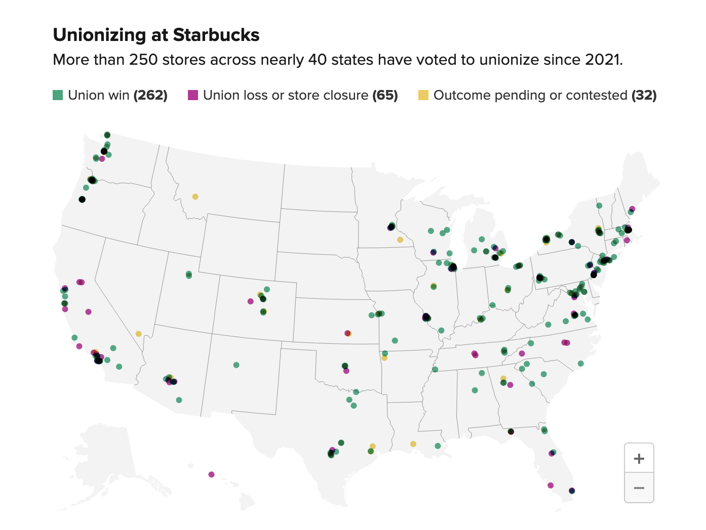
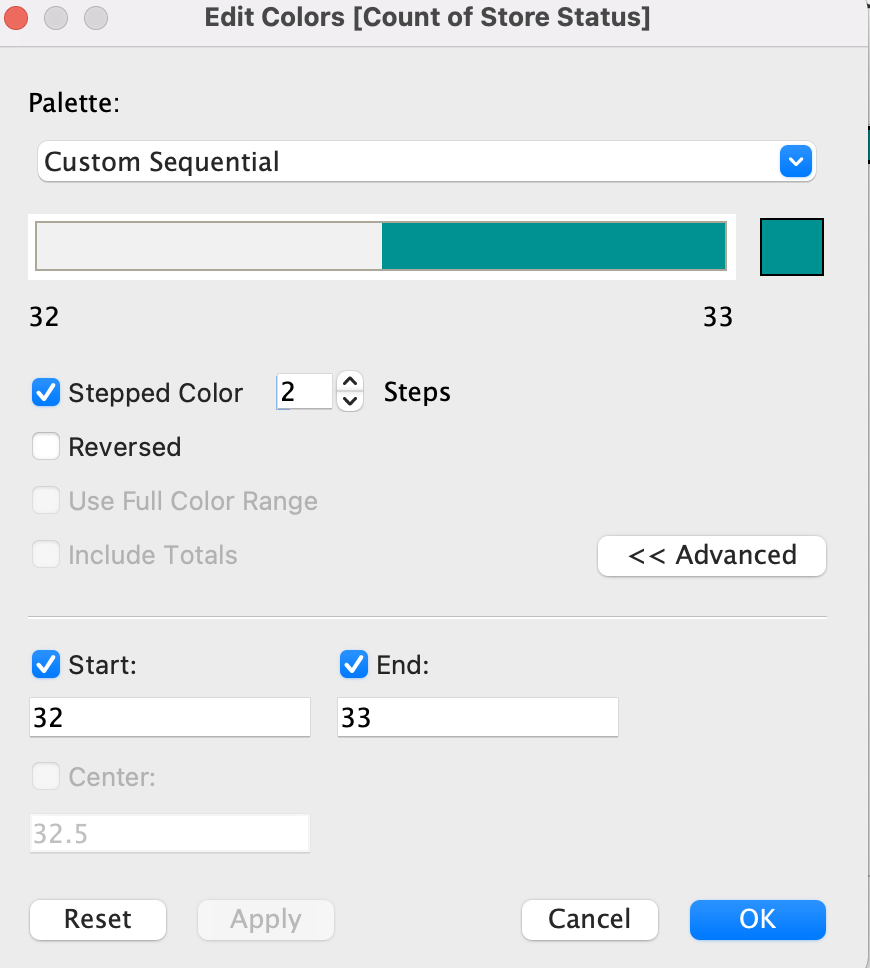

# Assignment 3 and 4

## Starbucks

This chart tries to show the reader the stores within the United States that have filed to become unionzed but have either won, loss or contested.

I picked this chart because I thought it would be more relatable to my audience compared to other data I found. I like Starbucks and I know a lot people like Starbucks. This chart looked interesting to work with. There are many ways to apply what I have learned in class to express this data in different ways. 

## Original Chart

[Data Source](https://docs.google.com/spreadsheets/d/11b4c6hOR-LmxNXQc2Q--Am4NiVAIAGzIBCPfDOwDU44/edit#gid=980621332)

[This article for this chart can be found here](https://www.cnbc.com/2022/12/09/map-of-starbucks-stores-that-voted-to-unionize.html)

I thought it was visually appealing to see the data shown on a map. The use of a map made clear to see what states are participating or have atleast tried to become unionized. The colors used in this chart are nice as well. The combination of the map and the colors draws someone to want to engage with the data to understand it more. 

However, the overlapping dots made the data shown unclear. The only colors shown in the legend are purple, green and yellow but in the map there are black dots as well. You have to zoom in to seperate the colors. I did not think it was necessary to show data on closed stores in the chart unless the stores closed because employees were trying to unionize. However, that is not clear from the data. 

## My Sketches

There is so much data provided. It seemed difficult to show all the details in a clear and concise way for the reader so I decided to steer away from trying to show every detail. I thought of two redesigns which are shown below.

### Sketch 1:

The first is a bar chart. I wanted to focus on a portion of the data so I decided to focus on the positives. The bar chart I created only focused on stores that have won being apart of the Union. Initially I did not think order mattered. I just wanted to show that these stores won. I thought if the reader was from that state and loved to go to Starbucks they would be proud with just knowing this information. This would probably encourage them to support their local Starbuck more. The colors of the bars are all blue because it is a neutral color and since the bars are not in any order I though changing the shades of the colors by size of the bar would be distracting. However, I thought adding the numbers to the end of the bars made it easier for the read and made it visually appealing. 

I chose this title because it gave a general idea of what the chart was about. It seemed like it would invite the reader to explore more. I decided not to write the specific states in my sketch because I was just brainstorming. The final build would eventually have the specific states. 

***
***

### Sketch 2:

The second chart is a part chart. In this chart I wanted to focus on the bigger picture. The idea was to show much Starbucks cared about the working conditions of their employees overall. So I created this chart that focused only on the Union Wins vs Union Losses in the United States. I chose the color green for Union Wins because that represented a good thing and red for Union Losses becauses that represented a bad thing.

I chose this title because I felt it went straight to the point of what I  wanted the readers to get from this data. 

## Initial User Feedback

After creating my sketches I received feedback from a couple of people. I asked the users the same questions for the charts which are listed below. The goal was for them to tell them what they understood I was trying to convey from just looking at the charts without me having to say anything. 

Questions Asked:

- Can you tell me what you think this is?

- Can you describe to me what this is telling you?

- Is there anything you find surprising or confusing?

- Who do you think is the intended audience for this?

- Is there anything you would change or do differently?

- is there anything you like/dislike about the charts?

- Is there any particular type of chart you like better?

### Student, mid 30s

This person liked the second chart better. They liked that it was straight to the point. 

- Can you tell me what you think this is?

I think this is a graphical representation of how many starbucks stores have unionized.

- Can you describe to me what this is telling you?

The first graph is telling me that many states have unionized multiple stores. The second graph is telling me there are more wins than loses.

- Is there anything you find surprising or confusing?

I would have liked each state labeled by their number instead of just “states”

- Who do you think is the intended audience for this?

General public that need to get the point fast without in depth detail.

- Is there anything you would change or do differently?

Just above comment.

- is there anything you like/dislike about the charts?

I like that they are succinct. The second one really drives the point home they are winning overall.

- Is there any particular type of chart you like better?

The second is simple but punchy to me.

### Student, late 20s

This person liked the first chart more 

- Can you tell me what you think this is?

The first chart looks like the number of stores that are unionized per state maybe, but it does not look like there are enough states. The second is just union wins versus losses.

- Can you describe to me what this is telling you?

It's telling me that an overwhelming number of stores want to unionize and starbucks wants to improve working conditions is why there are so many union wins.

- Is there anything you find surprising or confusing?

There is nothing to indicate the pending stores or losses in either charts. Additionally, the title over the second chart did not make sense in combination with the pie chart underneath. Finally, it does not appear that the number of states is correctly represented.

- Who do you think is the intended audience for this?

I don't think it's a general public, because they'd care about location information. Probably someone at starbucks who cares about the numbers more than the details like stockholders.

- Is there anything you would change or do differently?

Add more information to the y-axis of the first chart i.e. state names or regions or something, and add percentages to the second chart. Also a purpose for the second chart.

- is there anything you like/dislike about the charts?

I think pie charts are not great ways to portray a lot of information other than a quick summary such as this one. On it's own I don't like it, with the other one it is ok. I do like the first graph because it gives more information but it does not give more specific information such as what part of the state they are in.

- Is there any particular type of chart you like better?

For something like this a stacked bar chart of unionized, pending, or lost in the same fashion as the first one would be cool.

## Solution 1:
Since there was a tie I created two charts using Tableau based on their feedback. 

For the bar chart I understood that they wanted to see atleast the specific states

<noscript></noscript><object class='tableauViz'  style='display:none;'><param name='host_url' value='https%3A%2F%2Fpublic.tableau.com%2F' /> <param name='embed_code_version' value='3' /> <param name='site_root' value='' /><param name='name' value='Assignment34BarChart&#47;barchart' /><param name='tabs' value='no' /><param name='toolbar' value='yes' /><param name='static_image' value='https:&#47;&#47;public.tableau.com&#47;static&#47;images&#47;As&#47;Assignment34BarChart&#47;barchart&#47;1.png' /> <param name='animate_transition' value='yes' /><param name='display_static_image' value='yes' /><param name='display_spinner' value='yes' /><param name='display_overlay' value='yes' /><param name='display_count' value='yes' /><param name='language' value='en-US' /><param name='filter' value='publish=yes' /></object>
                

For the pie chart I understood that they wanted to see numbers included as well.

<noscript></noscript><object class='tableauViz'  style='display:none;'><param name='host_url' value='https%3A%2F%2Fpublic.tableau.com%2F' /> <param name='embed_code_version' value='3' /> <param name='site_root' value='' /><param name='name' value='Assignment34PieChart&#47;piechart' /><param name='tabs' value='no' /><param name='toolbar' value='yes' /><param name='static_image' value='https:&#47;&#47;public.tableau.com&#47;static&#47;images&#47;As&#47;Assignment34PieChart&#47;piechart&#47;1.png' /> <param name='animate_transition' value='yes' /><param name='display_static_image' value='yes' /><param name='display_spinner' value='yes' /><param name='display_overlay' value='yes' /><param name='display_count' value='yes' /><param name='language' value='en-US' /></object>
                

## More User Feedback

### In Class Group Disccusion: Students, early 20s - late 20a

The in class group discussion helped break the tie. My group liked the bar chart the most. What resonated with my group members the most was that I highlighted the leading state which was NY and that they were able to see which data belonged to a specific state. What I learned to make better is the amount of data shown in the bar chart. In the chart above you have to scroll to see the rest of the data. They suggested I just show the top 10. They suggested I change the title of the pie chart if I decided to keep it. A question that came up was why I removed the pending data. 

There were a couple of inspirations that came across from our discussion:
- Union should be added to the title so that it will be more clear
- Change numbers to percentages
- Add pending stores to show full story
- Compare stores that tried vs stores that won
- Show top 10 states

## Solution 2

Overall, I decided to just stick with a bar chart and remove the pie chart. 

Instead of only showing the number of stores that won, I am not showing the percentage of stores that won over the total number of stores that filed in that state. This changed the data shown and tells a better story. However, only showing the top 10 states doesnt show anyuthing meaningful in my opnion since all 10 are 100%. This made me feel like I wouuld have to change the chart again. Instead, I decided to expand to top 20. This did look as interesting as my original solution but it told a more accurate story si I decided to see how union losses would look like.

<noscript></noscript><object class='tableauViz'  style='display:none;'><param name='host_url' value='https%3A%2F%2Fpublic.tableau.com%2F' /> <param name='embed_code_version' value='3' /> <param name='site_root' value='' /><param name='name' value='twsd_class_discussion_revision&#47;Sheet2' /><param name='tabs' value='no' /><param name='toolbar' value='yes' /><param name='static_image' value='https:&#47;&#47;public.tableau.com&#47;static&#47;images&#47;tw&#47;twsd_class_discussion_revision&#47;Sheet2&#47;1.png' /> <param name='animate_transition' value='yes' /><param name='display_static_image' value='yes' /><param name='display_spinner' value='yes' /><param name='display_overlay' value='yes' /><param name='display_count' value='yes' /><param name='language' value='en-US' /></object>
                

## Final Solution:

I like this chart better because tthe chart shows more variety in the data. There are bigger differences between the number states. 

<noscript></noscript><object class='tableauViz'  style='display:none;'><param name='host_url' value='https%3A%2F%2Fpublic.tableau.com%2F' /> <param name='embed_code_version' value='3' /> <param name='site_root' value='' /><param name='name' value='Top10UnionRejections&#47;Sheet1' /><param name='tabs' value='no' /><param name='toolbar' value='yes' /><param name='static_image' value='https:&#47;&#47;public.tableau.com&#47;static&#47;images&#47;To&#47;Top10UnionRejections&#47;Sheet1&#47;1.png' /> <param name='animate_transition' value='yes' /><param name='display_static_image' value='yes' /><param name='display_spinner' value='yes' /><param name='display_overlay' value='yes' /><param name='display_count' value='yes' /><param name='language' value='en-US' /></object>
                

