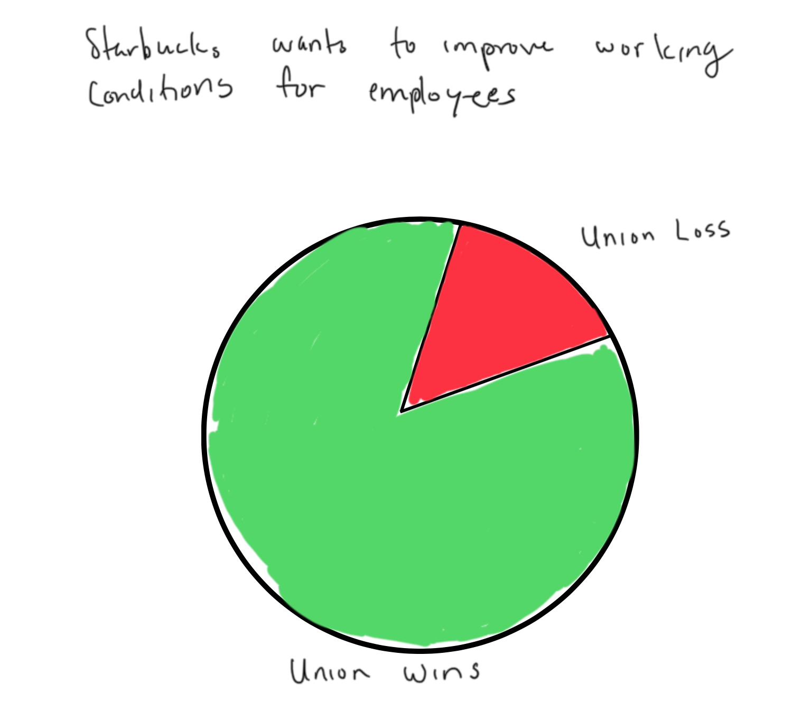

# Assignment 3 and 4

## Starbucks

## Original Chart

[This is the Artcle](https://www.cnbc.com/2022/12/09/map-of-starbucks-stores-that-voted-to-unionize.html)
[Data Source](https://docs.google.com/spreadsheets/d/11b4c6hOR-LmxNXQc2Q--Am4NiVAIAGzIBCPfDOwDU44/edit#gid=980621332)

I thought it was visually appealing to see the data shown on a map. The use of a map made clear to see what states are participating or have atleast tried to become unionized. The colors used in this chart are nice as well. The combination of the map and the colors draws someone to want to engage with the data to understand it more. 

However, the overlapping dots made the data shown unclear. The only colors shown in the legend are purple, green and yellow but in the map there are black dots as well. You have to zoom in to seperate the colors. I did not think it was necessary to show data on closed stores in the chart unless the stores closed because employees were trying to unionize. However, that is not clear from the data. 

## My Sketches

There is so much data provided. It seemed difficult to show all the details in a clear and concise way for the reader so I decided to steer away from trying to show every detail. I thought of two redesigns which are shown below.

### Sketch 1:

The first is a bar chart. I wanted to focus on a portion of the data so I decided to focus on the positives. The bar chart I created only focused on stores that have won being apart of the Union. Initially I did not think order mattered. I just wanted to show that these stores won. I thought if the reader was from that state and loved to go to Starbucks they would be proud with just knowing this information. This would probably encourage them to support their local Starbuck more. The colors of the bars are all blue because it is a neutral color and since the bars are not in any order I though changing the shades of the colors by size of the bar would be distracting. However, I thought adding the numbers to the end of the bars made it easier for the read and made it visually appealing. 

I chose this title because it gave a general idea of what the chart was about. It seemed like it would invite the reader to explore more. I decided not to write the specific states in my sketch because I was just brainstorming. The final build would eventually have the specific states. 

***
***

### Sketch 2:

The second chart is a part chart. In this chart I wanted to focus on the bigger picture. The idea was to show much Starbucks cared about the working conditions of their employees overall. So I created this chart that focused only on the Union Wins vs Union Losses in the United States. I chose the color green for Union Wins because that represented a good thing and red for Union Losses becauses that represented a bad thing.

I chose this title because I felt it went straight to the point of what I  wanted the readers to get from this data. 

## Feedback

## My Visualizations in Tableau

<noscript></noscript><object class='tableauViz'  style='display:none;'><param name='host_url' value='https%3A%2F%2Fpublic.tableau.com%2F' /> <param name='embed_code_version' value='3' /> <param name='site_root' value='' /><param name='name' value='Assignment34PieChart&#47;barchart' /><param name='tabs' value='no' /><param name='toolbar' value='yes' /><param name='static_image' value='https:&#47;&#47;public.tableau.com&#47;static&#47;images&#47;As&#47;Assignment34PieChart&#47;barchart&#47;1.png' /> <param name='animate_transition' value='yes' /><param name='display_static_image' value='yes' /><param name='display_spinner' value='yes' /><param name='display_overlay' value='yes' /><param name='display_count' value='yes' /><param name='language' value='en-US' /></object>
            

<noscript></noscript><object class='tableauViz'  style='display:none;'><param name='host_url' value='https%3A%2F%2Fpublic.tableau.com%2F' /> <param name='embed_code_version' value='3' /> <param name='site_root' value='' /><param name='name' value='Assignment34PieChart&#47;piechart' /><param name='tabs' value='no' /><param name='toolbar' value='yes' /><param name='static_image' value='https:&#47;&#47;public.tableau.com&#47;static&#47;images&#47;As&#47;Assignment34PieChart&#47;piechart&#47;1.png' /> <param name='animate_transition' value='yes' /><param name='display_static_image' value='yes' /><param name='display_spinner' value='yes' /><param name='display_overlay' value='yes' /><param name='display_count' value='yes' /><param name='language' value='en-US' /></object>
                

## Class Discussion

We had an in class discussion to get feedback from students in our class. 

I too there advice and came up with is new bar chart.

<noscript></noscript><object class='tableauViz'  style='display:none;'><param name='host_url' value='https%3A%2F%2Fpublic.tableau.com%2F' /> <param name='embed_code_version' value='3' /> <param name='site_root' value='' /><param name='name' value='twsd_class_discussion_revision&#47;Sheet2' /><param name='tabs' value='no' /><param name='toolbar' value='yes' /><param name='static_image' value='https:&#47;&#47;public.tableau.com&#47;static&#47;images&#47;tw&#47;twsd_class_discussion_revision&#47;Sheet2&#47;1.png' /> <param name='animate_transition' value='yes' /><param name='display_static_image' value='yes' /><param name='display_spinner' value='yes' /><param name='display_overlay' value='yes' /><param name='display_count' value='yes' /><param name='language' value='en-US' /></object>
                

However, I did not think this graph was impactful since most of it was 100%. So I decided to look at the Union losses.

## Final Visualizations in Tableau

This is my final design. 

<noscript></noscript><object class='tableauViz'  style='display:none;'><param name='host_url' value='https%3A%2F%2Fpublic.tableau.com%2F' /> <param name='embed_code_version' value='3' /> <param name='site_root' value='' /><param name='name' value='Top10UnionRejections&#47;Sheet1' /><param name='tabs' value='no' /><param name='toolbar' value='yes' /><param name='static_image' value='https:&#47;&#47;public.tableau.com&#47;static&#47;images&#47;To&#47;Top10UnionRejections&#47;Sheet1&#47;1.png' /> <param name='animate_transition' value='yes' /><param name='display_static_image' value='yes' /><param name='display_spinner' value='yes' /><param name='display_overlay' value='yes' /><param name='display_count' value='yes' /><param name='language' value='en-US' /></object>
                

