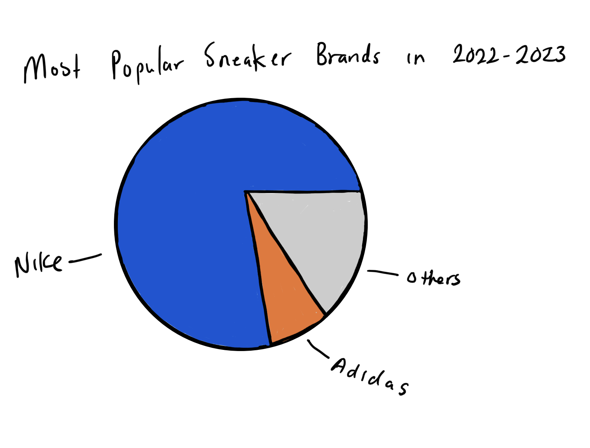
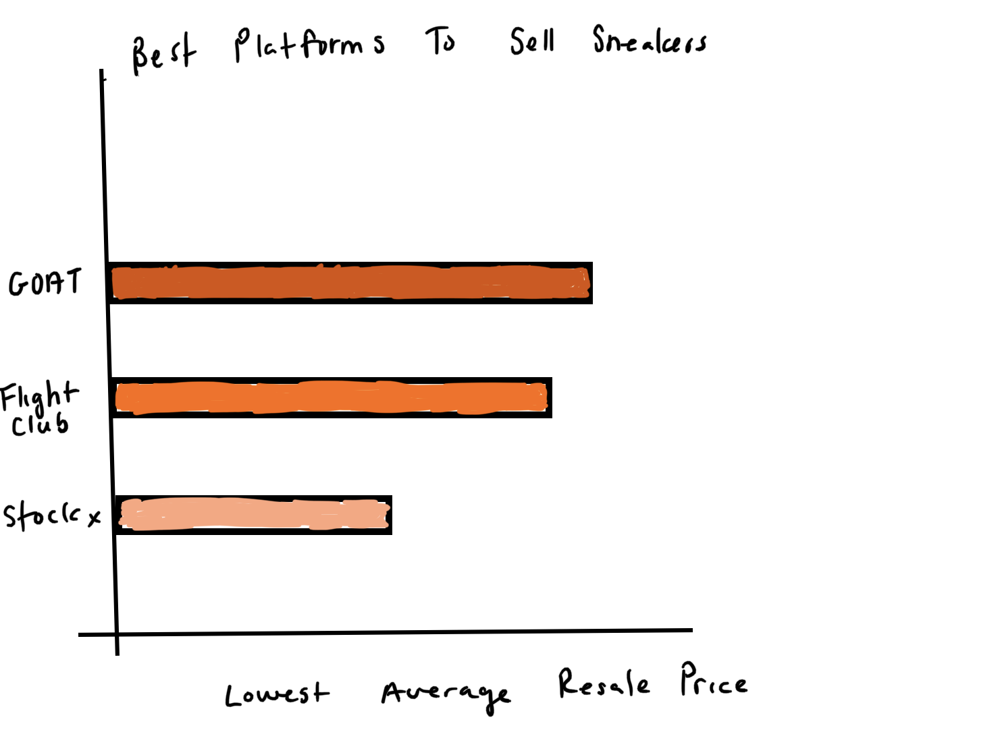

# Outline

In this day and age people have the opportunity to invest in other options besides the stock market and real estate. In this project I would like to explore the possiblility of investing in sneakers.

Investing in sneakers is when you sell sneakers at a higher price point then when you bought it. Typically, it is best to buy the sneakers at retail price so that you can maxmize your profit when you decide to sell. 

Not every sneaker is going to give you a great return on investment. You may even lose money! There are many factors that play a role in making a sneaker valuable such as:
-  Brand
-  Condition
-  Limited Quantity
-  Hype
-  Collaborations

In this project I would like to take the audience through the journey looking at sneaker reselling as an investment option.

# Initial Sketches

I first wanted to start with a overview of the most popular brands. I chose a pie chart because I felt it focused on the big picture. Nike is the most popular brand then Adidas. Most of the other brands only appeared in the data one time while Nike sneakers appeared over 600 times. I think it would be helpful to add the percentages but as a sketch I feel it gives the main idea of what the chart could look. 

After showing an overview of the most popular brands I feel it would be a good idea to discuss the platforms people can buy and sell from after a shoe has sold out of retail storees. I decided to go with a bar chart because it shows the comparison well. GOAT and FlightClub have similar pricing so a pie chart would not be helpful because it would be harder to see the slight difference. 

I would like to create more charts like comparing retail prices to resell prices for various but I am looking for more data in the mean time. 

# The Data

The data used in this project is from the [Sneaks API]("https://github.com/druv5319/Sneaks-API/blob/master/README.md"). This API pulls data from Stockx and GOAT which are some of the top sneaker reselling platforms in the world. Using this tool I pulled the most popular ~800 sneakers to date. I thought looking at the most popular sneakers would tell a better story that choosing random sneakers to analyze. The variables within this dataset include:
- Brand of the Sneaker
- Retail Price
- Lowest Resell Price on Stockx and GOAT as of 2/13/2023
- Name of the Sneaker
- Release Date of the Sneaker

All of these variables are important for people who want to buy or resell sneakers. Data like this helps people make informed decisions on how to price sneakers and what to look out for. The API gave alot of data such id numbers, brand, sneaker name, retail price, lowest resell price, image links and much more. However, I felt it was necessary to only keep a few of the variables which some are listed above. 

The data from the API was in a JSON format so I had to clean and reformat it to be able to understand the data better. I put the data into a csv file which can be found [here](/SneakerData.csv). 

# Medium and Method

My final project will be done using Shorthand. This tool will be helpful for me to focus on telling the story of investing in sneakers in an interactive way. I will start by giving a general overview of sneaker reselling and highlight various insights throughout the preentation.
