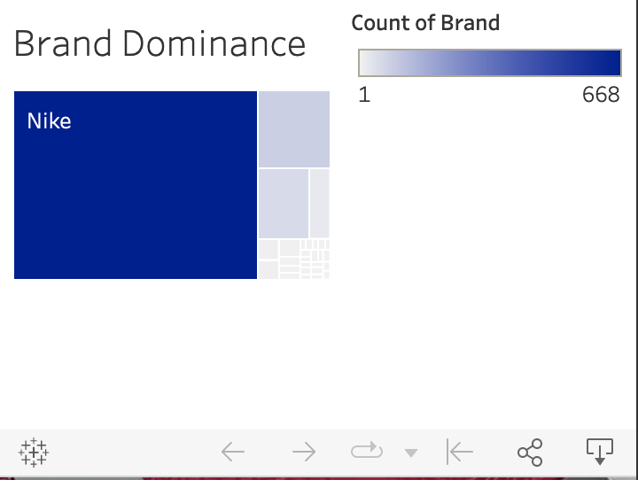

| [home page](https://maxineattobrah.github.io/portfolio/) | [visualizing debt](dataviz2.md) | [critique by design](assignment3and4.md) | [final project I](final_project_maxineattobrah.md) | [final project II](final_project_part_2_maxineattobrah.md) | [final project III](final_project_part_3_maxineattobrah.md) |

# The final data story
> Include a link to your final data story on Shorthand, Esri StoryMaps, etc. here. 

The final data story can be viewed [here](https://carnegiemellon.shorthandstories.com/a-story-on-selling-sneakers/index.html)

# Final design decisions: Changes made since Part II
> Include few paragraphs that reflects on changes you made since the completion of Part II. 

There has been alot of changes made since Part II. I will discuss them in sections.
 
<b>Headers</b>
 
I created headers to create a self-guided experience for the reader. Initially the site was not set up for someone to understand the flow of everything. There were "big ideas" to get a general sense of what I was trying to say. I am hoping this new approach will make it clear exactly what I am saying.

<b>Images/Videos</b>
 
People liked that I added the images of the shoes I was talked about because it helped them see what the shoe looked like. Instead of adding images of sneakers I decided to add more videos instead.  This would not only let me people see the shoe about but now they can get a more detailed information when they watch the video. The videos also helped tie in the the reasons of how social media affects sneaker resell prices. As of right now I was only able to get reaction for students in the class during the presentation towards the Tik Tok video that autoplayed but they seemed to enjoy that new feature. The videos help the user get a 360 view of the shoe. 

<b>Call to Action</b>
 
Initially, I was not sure what my call to action should be. I thought it would be a good idea to have links to the marketplaces since I spoke about the various marketplaces people can buy and sell sneakers. The general idea is that since they have learned a little bit about the platform now they should go explore those platforms. 

After discussing it with some people that would be like releasing someone into the wild too quickly. Someone completely new to this industry should not try selling right away. This is not like buying stocks of the S&P 500. Instead, the reader should continue to learn more information about sneakers. I added some links to youtube channels of sneaker enthusiasts that give good reviews on sneakers and the platforms that were mentioned in this video. This way newbies can find more ways to learn from others before jumping in to try their first sale.

<b>Charts</b>
 
Most people that I interviewd and in my class discussion group felt my charts were effective. However, there were some charts that people had trouble understanding. Mainly the graphs I originally had in Tableau. 

During the interview process there were some people I just sent a link to the website and sent the questions. I wanted to see if people could get the general idea without me having to say anything ot direct them. As I was fixing my website for part III I decided to look at the website using the mobile view. I noticed that the Tableau charts look very different on Mobile.

I did not notice that bedoew so I ended up changing the treemap to a word cloud to illustrate that Nike is the most talked about brand in terms of what people are looking to buy. I aslo changed the data represented in the bar chart to focus more on the annual revenue each platform are making instead. 

I had a hard time deciding which shoes to display. There are so many interesting shoes! I thought adding more shoes would build excitement for the reader but I did not like contionously scrolling. I decided to focus on three charts. 

I also tried to match the line charts with the colors of the shoes but kept the color of the retail the price. I really wanted to emphasize the return on investment people were making on the resell market and what they were not making. 
 
 

 
## The audience
> Talk about who you identified as the audience for your final data story.  Include any other information you've used that helped you narrow the focus (e.g. insights from your interviews, personas, etc.).  Note any specific adjustments you made to your final project to make it work for your audience.

My audience are sneaker enthusiasts who are interested in getting into sneaker reselling as discussed in the persona section in part II. The focus of my story is for someone who is new to this industry. I want to give them a general idea guide on selling sneakers to help them get started.  

## References
> You should have already included detailed references on your Shorthand story - if so, you can probably skip this section.  Use this section to capture any additional special notes or information necessary.  If you do this, you probably want to include a link from Shorthand to this page. Make sure to double-check that you aren't using copyright material and that you have added / updated any citations or other content that you used to create your data story.  Make sure you have cited external sources correctly. 

Resources:

https://www.sothebys.com/en/articles/off-white-x-nike-the-history-behind-virgil-ablohs-sneaker-collaborations

https://stockx.com/

https://www.goat.com/

# Final thoughts
> You can summarize any final thoughts / reflections that don't fit well in the previous sections here.  How did it go?  What did you run out of time for, or wish you had a chance to revisit?  What were you most excited about?  Include any final reflections as you think they might help us understand your process.  If you already included such reflections elsewhere, you can delete this section. 

I enjoyed trying different charts and colors to visualize the data. Wireframing the chsrts before doing the actual implementation helped alot to focus on the big picture and get feedbaack before putting too much work in. The interviews, group class discussions, conversations with the Professor and TA really helped me focus my story and create better effective as well as visualling appealing charts. I liked having the opportuity to create charts on Tableau and Flourish. If I had more time I would look into more ways to clean up the x-axis on the line charts. 
